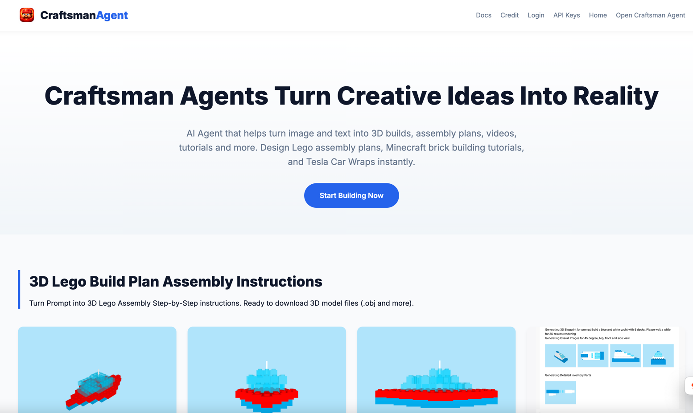
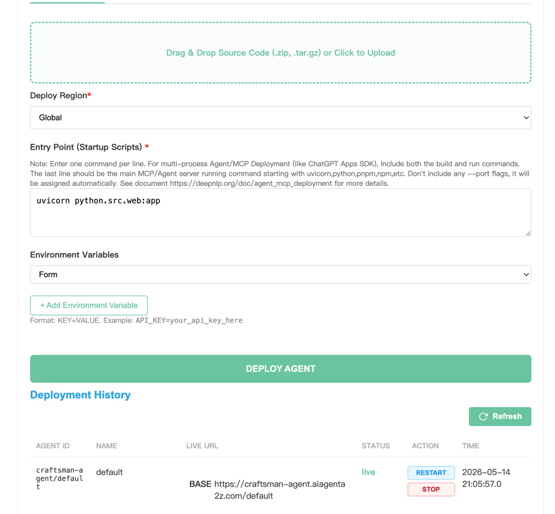

## Quickstart  Static Website Deployment

[Website](https://www.deepnlp.org/workspace/deploy) | [GitHub](https://github.com/aiagenta2z/agent-mcp-deployment-templates) | [AI Agent Marketplace](https://www.deepnlp.org/store/ai-agent) | [AI Agent A2Z](https://www.aiagenta2z.com)

### Introduction

This templates implements a typescript based website server with static files of index.html and /static folder containing images.
The website is live on [https://craftsman-agent.aiagenta2z.com](https://craftsman-agent.aiagenta2z.com) with subdomain registered
as "craftsman-agent".  You can use this template to deploy your own website with live URL as `https://{subdomain}.aiagenta2z.com`.




### Usage

**Running Locally**
```shell
cd ./quickstart/website_typescript
pnpm install
pnpm run serve
```

Other CLIs to manage Server

```shell
### Start it
pnpm install
pnpm run serve

### Dev watch mode:
pnpm run dev

### Notes:
- Set PORT / HOST env vars if needed (defaults: 8000 / 0.0.0.0).
PORT=8100 ENV=local pnpm run serve
```

**Deployment on AI Agent A2Z**

Visit Deployment Panel [Deployment](https://www.deepnlp.org/workspace/deploy) .
Login and choose the default project with unique_id "${user_name}/default" (In our case: "craftsman-agent/default"). 
Note that the final Live URL `default` url param will be removed. And the deployed website URL starts from the root path as `https://{subdomain}.aiagenta2z.com/{url}`.



**Step 1**:  Choose project "craftsman-agent/default"   
**Step 2**:  Prepare Uploaded Source Code File and Upload
```shell
cd ./quickstart/website_typescript
tar czvf craftsman-agent-homepage.tar.gz .
```

**Step 3**: Fill Region and Entry Points to start website
Region: Global
Entry Point: 
```shell
### Running Locally
pnpm run serve
```
Don't include any port or host information. The platform will assign next available ports automatically.


**Step 4**: Environment Variables (Optional)   
**Step 5**: Click Deployment

And once deployment is completed, just visit the deployed URL: `https://craftsman-agent.aiagenta2z.com`.
Note that https://craftsman-agent.aiagenta2z.com/default is the default project and the URL param "default" will be obsoleted handled by the platform and
all static files, endpoints starts from the root.


**Note**
Static file will starts from the root directory: 
e.g. Icon URL: https://craftsman-agent.aiagenta2z.com/static/website/agent_icon.jpg 
Mapped to local static image file under folder: `./static/website/agent_icon.jpg` 
